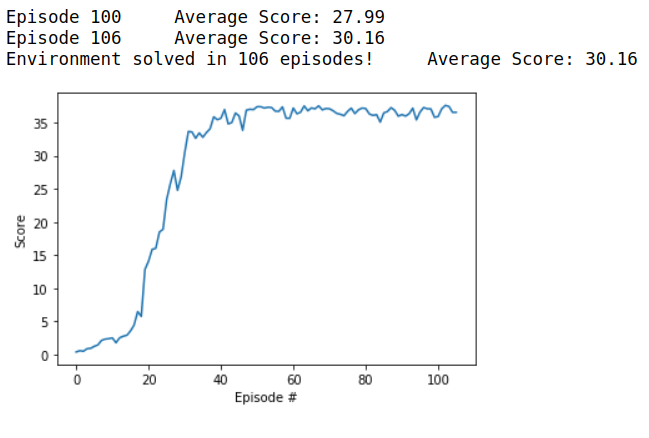

[//]: # (Image References)

# Project 2: Continuous Control - Report

### Settings

**Implementation:** The project is implemented in `python 3.6` and within a `jupyter notebook`. 
The following packages where imported:
```python
from unityagents import UnityEnvironment
import numpy as np
import copy

import torch
import torch.nn as nn
import torch.nn.functional as F
import torch.optim as optim

import time
import random

from collections import namedtuple, deque

from ddpg_multi_agents import Agents

import matplotlib.pyplot as plt
%matplotlib inline
```
The agent has been implemented within `ddpg_multi_agents.py`.
The actor and critic model has been implemented within `ddpg_models.py`.
**`Pytorch 1.4.0`** has been used with **`CUDAToolkit 10.1`**.
The operating system is `ubuntu 18.04`.
Unity 2019.3 has been installed on the computer.
The Unity environment is `Banana_Linux/Banana.x86_64` and has been provided by Udacity. 

### Model

The project has been solved with the help of two deep neural networks: 
The **Actor** NN consisting of **4 linear layers**:
- one input layer of size 33 (=size of the state space).
- two hidden layers of size 128 each.
- one output layer of size 4 (= size of the action space).
The activateion function is **Relu**.
A **batch normalization** is used for the input and the two hidden layers.

### Agent

The project has been solved with a **DDPG** agent. 
- The replay buffer size is 100000
- The batch size is 128
- Gamma = 0.99
- Tau = 0.001 (for soft update of target parameters)
- Learning rate for the Actor = 0.0001
- Learning rate for the Critic = 0.001
- The weight decay is 0
The Implementation of the DDGP agent is done according to [`DDPG`](https://arxiv.org/pdf/1509.02971.pdf)

### Training

The maximum number of training episodes is 500.
The maximum number of timesteps per episode is 1000.

### Result

The result of the training is shown in the plot below: 



